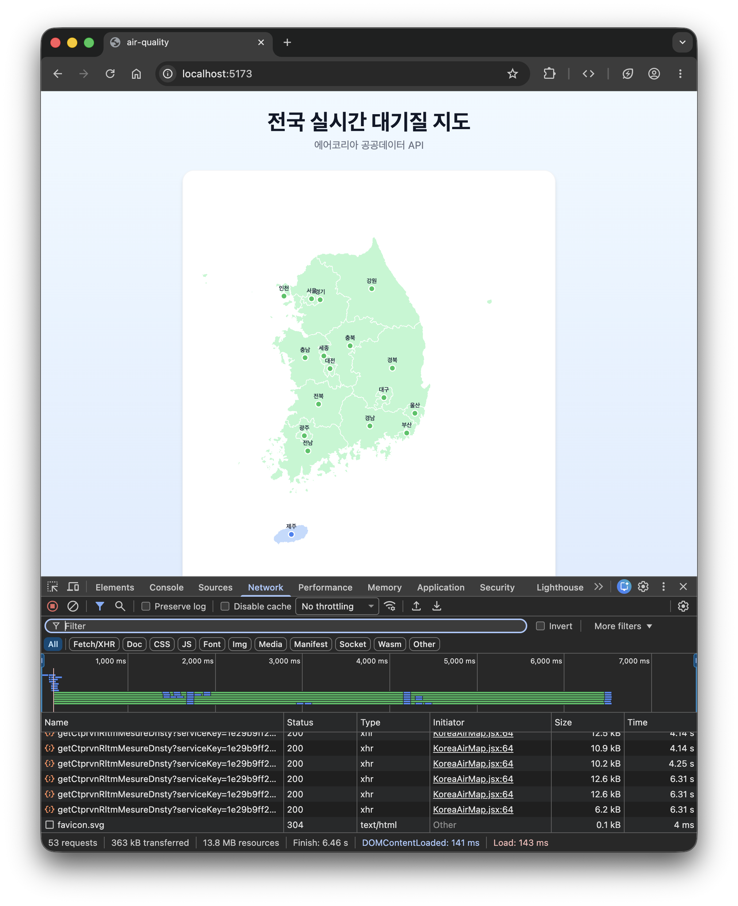

# 전국 실시간 대기질 지도

에어코리아 공공데이터 API를 활용한 전국 시도별 실시간 대기오염 정보 시각화 프로젝트

## 실행 결과



## 사용 기술

- React + Vite
- Tailwind CSS
- Axios
- d3-geo

## 주요 기능

- 에어코리아 API로 17개 시도 대기질 데이터 실시간 조회
- 시도별 통합대기환경지수(CAI) 등급에 따른 색상 표시
- 마우스 hover 시 PM10 / PM2.5 수치 툴팁 표시

## 실행 방법

```bash
npm install
npm run dev
```

> `.env` 파일에 API 키를 직접 입력해야 합니다.

```
VITE_API_KEY=발급받은_서비스키
VITE_API_URL=https://apis.data.go.kr/B552584/ArpltnInforInqireSvc/getCtprvnRltmMesureDnsty
```
